# Decentralized Grid Authentication 🛡️

<<<<<<< HEAD
This project is a decentralized visual password system built on the Ethereum blockchain. Instead of a traditional text-based password, users authenticate by selecting a unique, sequential pattern of colors on a dynamic 9x9 grid. The user's secret pattern is encrypted end-to-end using a key derived from their wallet's signature and stored securely on-chain.

---

## 📸 Project Demo

Here is a step-by-step walkthrough of the application's user flow.

### **1. Welcome & Wallet Connection**
*The user is greeted on the home page and connects their MetaMask wallet to begin.*

<table>
  <tr>
    <td align="center">1. Home Screen</td>
    <td align="center">2. MetaMask Unlock</td>
    <td align="center">3. Wallet Connected</td>
  </tr>
  <tr>
    <td>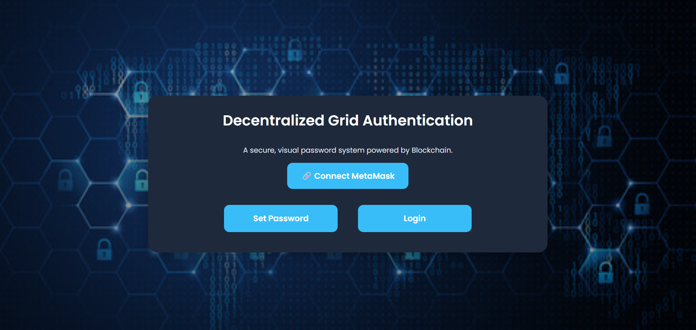</td>
    <td>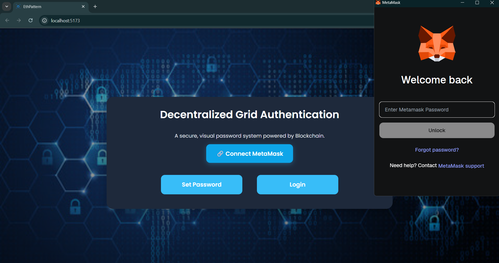</td>
    <td>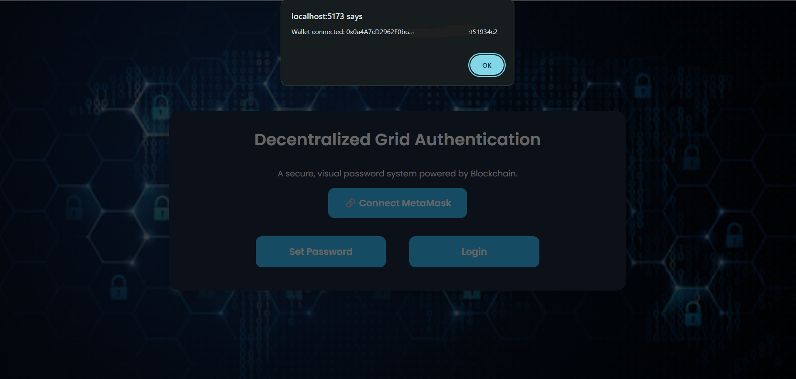</td>
  </tr>
</table>

### **2. New User Registration (Password Setup)**
*A new user selects a 4-box pattern, signs a message to create a secure key, and confirms the transaction to save their encrypted pattern on the blockchain.*

<table>
  <tr>
    <td align="center">1. Select Pattern</td>
    <td align="center">2. Create Secure Key</td>
    <td align="center">3. Approve Signature</td>
  </tr>
  <tr>
    <td>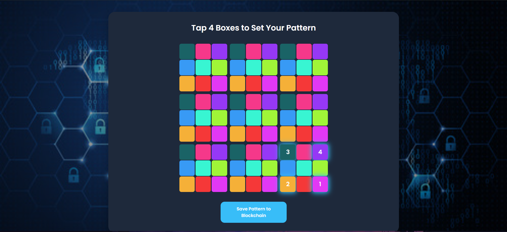</td>
    <td></td>
    <td>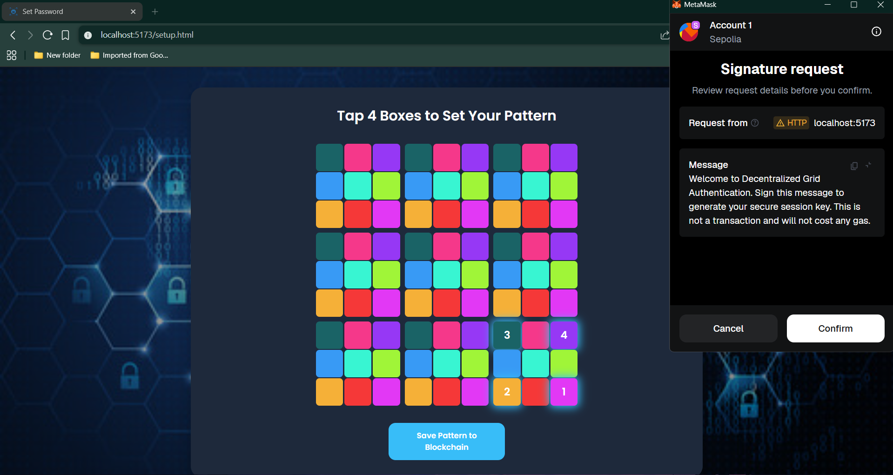</td>
  </tr>
  <tr>
    <td align="center">4. Confirm Transaction</td>
    <td align="center">5. Await Confirmation</td>
    <td align="center">6. Registration Success</td>
  </tr>
  <tr>
    <td>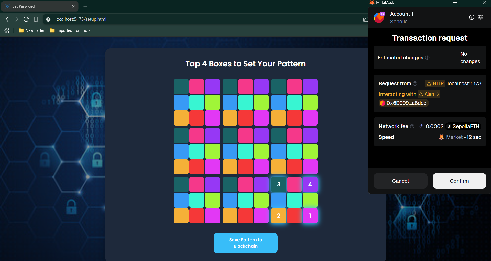</td>
    <td></td>
    <td>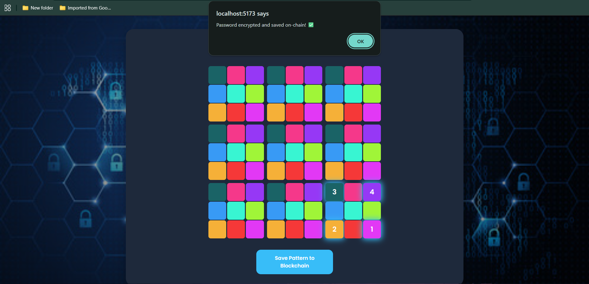</td>
  </tr>
</table>

### **3. Login & Authentication**
*An existing user is presented with a dynamic grid. They enter the PIN, sign a message to securely decrypt their pattern, and are granted access.*

<table>
<tr>
<td align="center">1. Enter Dynamic PIN</td>
<td align="center">2. Prompt to Decrypt</td>
<td align="center">3. Approve Signature</td>
</tr>
<tr>
<td>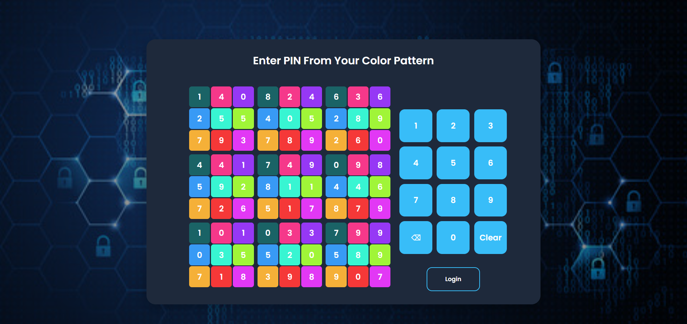</td>
<td>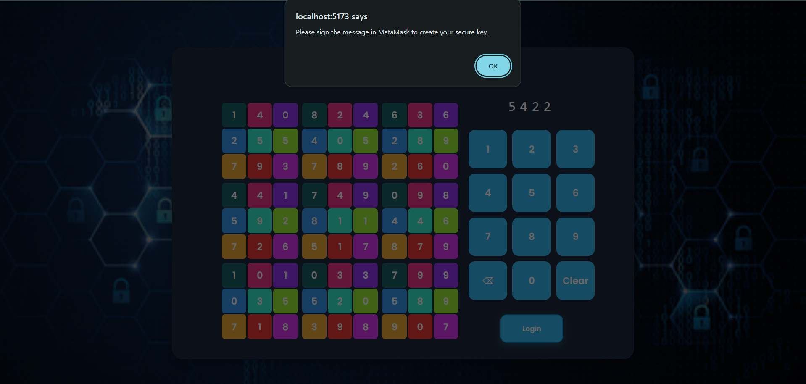</td>
<td>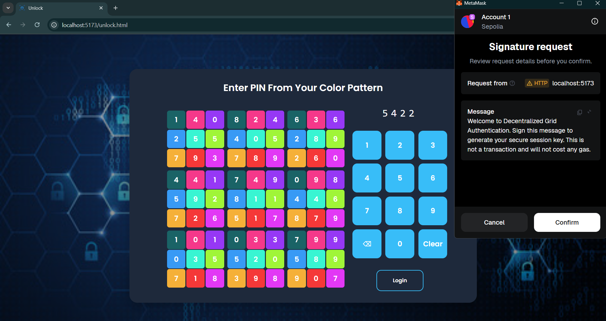</td>
</tr>
</table>

### **4. Successful Login Dashboard**
*After a successful login or update, the user is taken to their secure dashboard, which displays their connected wallet address.*

<table style="margin-left: auto; margin-right: auto; width: 50%;">
<tr>
<td align="center">Access Granted</td>
</tr>
<tr>
<td align="center">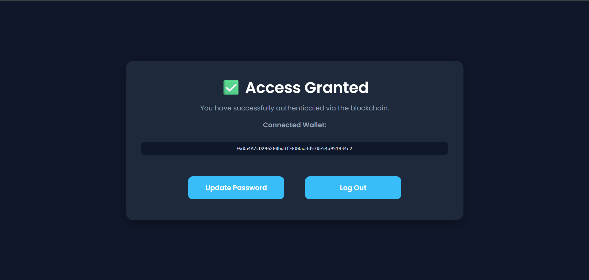</td>
</tr>
</table>

### **4. Updating an Existing Password**
*From the dashboard, a logged-in user can choose to update their pattern. They select a new pattern, sign a message, and confirm the transaction to update their encrypted data on the blockchain.*

<table>
<tr>
<td align="center">1. Select New Pattern</td>
<td align="center">2. Create Secure Key</td>
<td align="center">3. Approve Signature</td>
</tr>
<tr>
<td>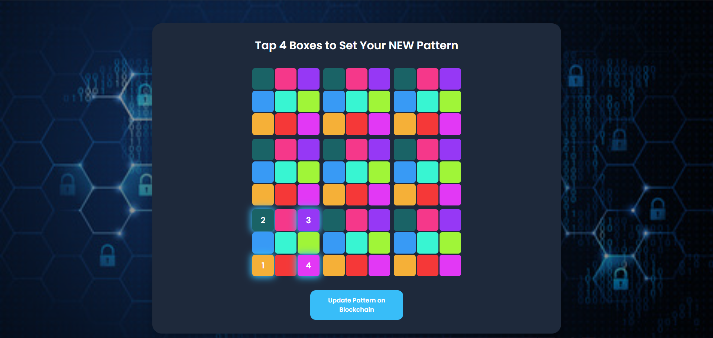</td>
<td>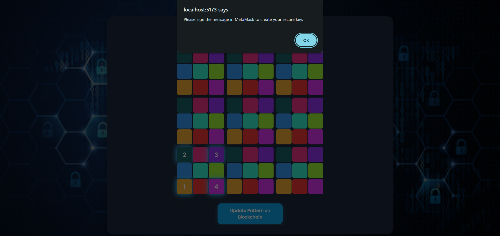</td>
<td>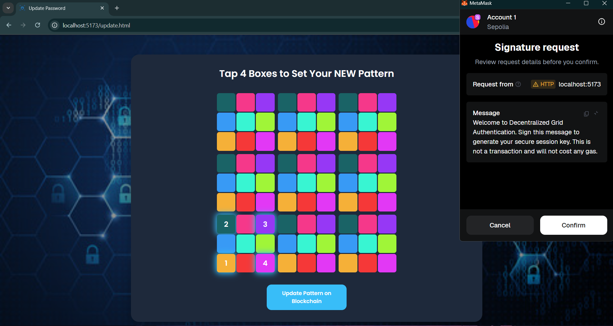</td>
</tr>
<tr>
<td align="center">4. Confirm Transaction</td>
<td align="center">5. Await Confirmation</td>
<td align="center">6. Update Success</td>
</tr>
<tr>
<td>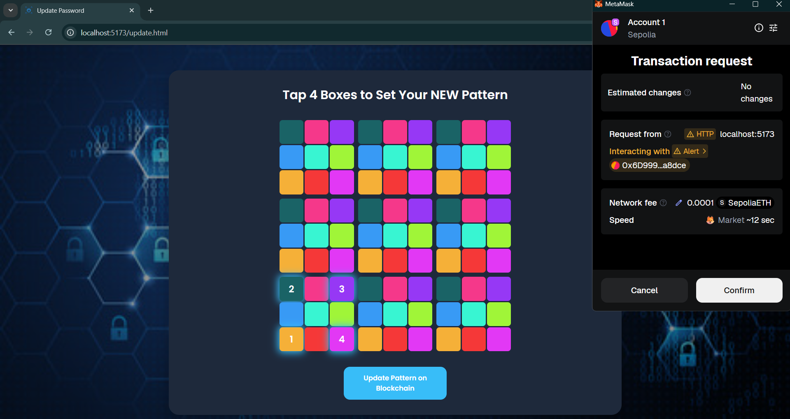</td>
<td>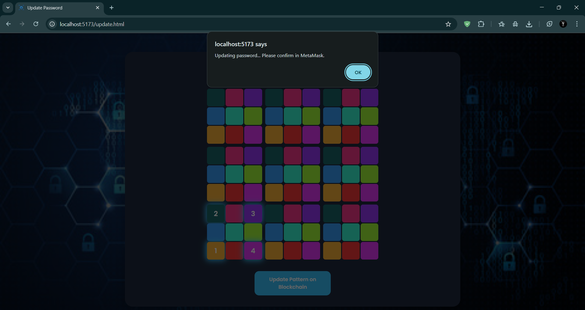</td>
<td>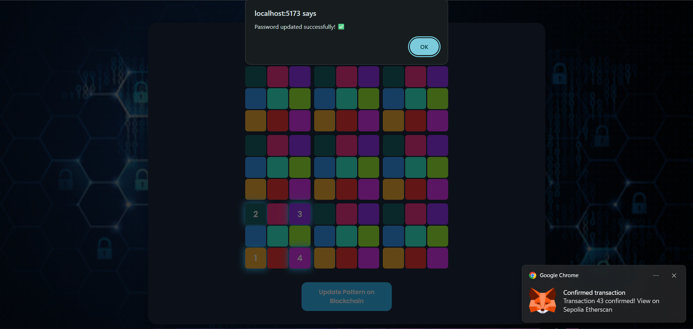</td>
</tr>
</table>

---

## ✨ Core Features

* **Decentralized Authentication:** User credentials are not stored on a central server, eliminating a major attack vector.
* **End-to-End Encryption:** The secret password pattern is encrypted in the browser before being sent to the smart contract. It can only be decrypted by the user after they provide a valid signature.
* **Signature-Based Keys:** A unique and secure encryption key is generated on the fly from the user's cryptographic signature, meaning the key is never stored anywhere.
* **Dynamic PIN System:** The visual grid randomizes on every login, making the system highly resistant to shoulder-surfing and replay attacks.
* **Web3 Integration:** Connects seamlessly with MetaMask for user identity, transaction signing, and message signing.

---

## 🚀 How It Works

1.  **Setup:** A user connects their MetaMask wallet and selects a 4-box pattern. They are then prompted to sign a message, which generates a unique signature. This signature is used as a secret key to encrypt the pattern's data. The resulting ciphertext is stored on the smart contract.
2.  **Login:** The user is presented with a new, randomized grid and enters the 4-digit PIN corresponding to their secret pattern.
3.  **Decryption & Verification:** The user is asked to sign the same message again to re-generate the secret key. The application fetches the ciphertext from the blockchain, decrypts it using the new key, and verifies that the entered PIN matches the decrypted pattern.

---

## 🛠️ Technology Stack

* **Frontend:** HTML5, CSS3, JavaScript (ES6+ Modules)
* **Blockchain:** Solidity, Ethereum (Sepolia Testnet)
* **Web3 Integration:** Ethers.js v5
* **Build Tool:** Vite with npm
* **Encryption:** `crypto-js` (AES)

---

## ⚙️ Setup and Installation

This guide will walk you through setting up the project from scratch.

### **Step 1: Install Prerequisites**

* A modern browser like **Google Chrome** with the **[MetaMask](https://metamask.io/)** extension.
* **[Node.js](https://nodejs.org/)** (which includes npm).
* **[Git](https://git-scm.com/)**.

### **Step 2: Set Up MetaMask & Testnet**

1.  **Create a Wallet:** Set up a new, clean wallet in MetaMask for testing.
2.  **Switch to Sepolia:** In MetaMask, switch the network to the **Sepolia** testnet.
3.  **Get Test ETH:** Use a public faucet (e.g., [sepolia-faucet.pk910.de](https://sepolia-faucet.pk910.de/)) to get free test ETH for your new wallet.

### **Step 3: Run the Project Locally**

1.  **Clone the repository:**
    ```bash
    git clone [https://github.com/Rudrateja123/Decentralized-Grid-Authentication.git](https://github.com/Rudrateja123/Decentralized-Grid-Authentication.git)
    cd Decentralized-Grid-Authentication
    ```
2.  **Install dependencies:**
    ```bash
    npm install
    ```
3.  **Configure the Smart Contract:**
    * Deploy the `GridAuth.sol` contract (the version that stores an encrypted string) to the Sepolia testnet using Remix IDE.
    * Open `script.js` and update the `CONTRACT_ADDRESS` and `CONTRACT_ABI` variables with your new deployment details.
4.  **Run the development server:**
    ```bash
    npm run dev
    ```
    The project will now be running in your browser, typically at `http://localhost:5173`.

---

## 📄 License

This project is licensed under the MIT License.
=======
This project is a decentralized visual password system built on the Ethereum blockchain. Instead of a traditional text-based password, users authenticate by selecting a unique, sequential pattern of colors on a dynamic 9x9 grid. The user's secret pattern sequence is stored securely as an array on the blockchain via a smart contract, providing a high-security, trustless login experience.


**[Link to Live Demo]** <--- *(coming soon)*

---

## ✨ Core Features

* **Decentralized Authentication:** User credentials (the pattern sequence) are stored on-chain, not on a central server, making the system highly secure and tamper-proof.
* **Visual Password:** Replaces traditional passwords with a more intuitive and shoulder-surf-resistant color pattern sequence.
* **Dynamic Grid:** The numbers on the grid randomize on every login attempt and after every failure, preventing replay attacks and making it difficult for onlookers to guess the PIN.
* **Web3 Integration:** Connects seamlessly with MetaMask for user identification and signing transactions.
* **User-Controlled:** Only the wallet owner can set or update their password pattern, giving users full control over their own credentials.

---

## 🚀 How It Works

1.  **Setup:** A user connects their MetaMask wallet and is presented with a colored grid. They select four cells in a specific sequence that becomes their password. This sequence of cell indices (e.g., `[10, 45, 2, 68]`) is then sent to the `GridAuth` smart contract in a transaction and stored against their wallet address.
2.  **Login:** The user is presented with a new, dynamic grid where the colors are in the same positions, but the numbers inside are randomized.
3.  **Verification:** The user identifies their secret color pattern, notes the new numbers in their sequence, and enters the resulting 4-digit PIN. The application fetches the stored positions from the blockchain, retrieves the corresponding numbers from the current grid, and verifies if the PIN matches.

---

## 🛠️ Technology Stack

* **Frontend:** HTML5, CSS3, JavaScript (ES6+)
* **Blockchain:** Solidity, Ethereum (Sepolia Testnet)
* **Web3 Integration:** Ethers.js v5
* **Development Environment:** VS Code, Live Server, MetaMask

---

## ⚙️ Setup and Installation

This guide will walk you through setting up the project from scratch, including all the necessary Web3 tools.

### **Step 1: Install Prerequisites**

Make sure you have the following software installed on your computer:
* A modern web browser like **Google Chrome** or Firefox.
* The **[MetaMask](https://metamask.io/)** browser extension.
* **[Git](https://git-scm.com/)** for version control.
* **[Visual Studio Code](https://code.visualstudio.com/)** with the **Live Server** extension.

### **Step 2: Set Up Your MetaMask Wallet 🦊**

1.  **Install MetaMask:** Add the MetaMask extension to your browser from the official website.
2.  **Create a Wallet:** Open the extension and follow the prompts to "Create a new wallet".
3.  **⚠️ Important:** Write down your **Secret Recovery Phrase** on a piece of paper and store it somewhere safe. Never share this with anyone or store it digitally. This is the master key to your wallet.

### **Step 3: Switch to the Sepolia Test Network**

To interact with the smart contract without spending real money, we'll use a free "test network".

1.  Open MetaMask.
2.  Click the network dropdown at the top-left.
3.  Find and select the **Sepolia** network from the list. If you don't see it, you may need to go into settings and enable "Show test networks".

### **Step 4: Get Free Test ETH from a Faucet 💧**

A "faucet" is a website that gives out free, valueless test currency for developers.

1.  **Copy Your Address:** In MetaMask, click on your account name to copy your wallet address (it starts with `0x...`).
2.  **Visit a Faucet:** Go to a public Sepolia faucet website, such as **[sepoliafaucet.com](https://sepoliafaucet.com/)**.
3.  **Request Funds:** Paste your wallet address into the faucet's input box and request the test ETH. It may take a minute or two to arrive in your wallet.

### **Step 5: Run the Project Locally**

Now that your environment is ready, you can run the application.

1.  **Clone the repository:** Open your terminal, navigate to where you want to store the project, and run:
    ```bash
    git clone https://github.com/Rudrateja123/Decentralized-Grid-Authentication.git
    cd Decentralized-Grid-Authentication
    ```

2.  **Configure the Smart Contract (Optional):**
    * The project is pre-configured with a working smart contract. If you deploy your own version of `GridAuth.sol`, open `script.js` and update the `CONTRACT_ADDRESS` and `CONTRACT_ABI` variables.

3.  **Run the application:**
    * Open the `Decentralized-Grid-Authentication` folder in VS Code.
    * Right-click on `index.html` and select **"Open with Live Server"**. The project will now be running in your browser!

---

## 📄 License

This project is licensed under the MIT License.
>>>>>>> 4c6a4cd60aa1db493b1a43478308690fdd1a37c1
