# 🧩 Decentralized Grid Authentication

*A blockchain-based prototype exploring client-side encryption and user-controlled authentication.*

---

## 🚀 Overview

**Decentralized Grid Authentication (DGA)** is an academic project that demonstrates how **blockchain transparency** and **client-side cryptography** can be combined to design a visual, user-controlled authentication mechanism.
Instead of a traditional password, users register by selecting a **pattern on a 9×9 color-coded grid**.
The selected positions are **AES-encrypted client-side** (with a key derived from the user’s MetaMask wallet signature) and stored on the **Ethereum blockchain** through a **Solidity smart contract**.

During login, the encrypted data is retrieved from the blockchain, **decrypted locally**, and matched against a dynamically randomized grid to verify the user’s identity — all without any centralized server.

---

## 🧠 Project Objectives

* Explore **fully decentralized user registration** without central databases.
* Study the **trade-offs** between decentralization, immutability, and privacy.
* Implement **client-side AES encryption** integrated with **MetaMask signing**.
* Analyze the viability of **visual grid-based authentication** on public blockchains.

---

## 🧭 System Architecture

```
                   ┌────────────────────────────────────┐
                   │        🧩 User Interface (DApp)     │
                   │------------------------------------│
                   │  - 9×9 Dynamic Grid (HTML/CSS/JS)   │
                   │  - User selects 4 secret positions  │
                   │  - AES Encryption (CryptoJS)        │
                   │  - MetaMask Integration (Ethers.js) │
                   └────────────────────────────────────┘
                                       │
                                       │ (1) User connects MetaMask
                                       ▼
                      ┌────────────────────────────────────┐
                      │       🔑 Wallet (MetaMask)          │
                      │------------------------------------│
                      │ - Generates key pair (public/private)
                      │ - Signs message for key derivation
                      │ - Approves blockchain transaction
                      └────────────────────────────────────┘
                                       │
                                       │ (2) Key derived from signature
                                       ▼
                      ┌────────────────────────────────────┐
                      │   🔒 Client-Side AES Encryption     │
                      │------------------------------------│
                      │ - Derives AES key from wallet sig  │
                      │ - Encrypts grid pattern locally     │
                      │ - Produces ciphertext string        │
                      └────────────────────────────────────┘
                                       │
                                       │ (3) User confirms MetaMask tx
                                       ▼
                      ┌────────────────────────────────────┐
                      │     ⛓️  Ethereum Blockchain         │
                      │------------------------------------│
                      │ - Executes GridAuth.sol contract    │
                      │ - Stores ciphertext in mapping       │
                      │   (address → encryptedPositions)     │
                      │ - Emits Registered/Updated events   │
                      └────────────────────────────────────┘
                                       │
                                       │ (4) Data stored immutably
                                       ▼
                      ┌────────────────────────────────────┐
                      │        🧠 On-Chain State            │
                      │------------------------------------│
                      │ Example:                           │
                      │ 0xABC123... → "U2FsdGVkX1+Z0W..."   │
                      │ Public, but encrypted               │
                      └────────────────────────────────────┘
                                       │
                                       │ (5) On login, retrieve ciphertext
                                       ▼
                      ┌────────────────────────────────────┐
                      │     🔓 Client-Side Decryption       │
                      │------------------------------------│
                      │ - Wallet signs again (new session)  │
                      │ - Re-derives AES key                │
                      │ - Decrypts ciphertext               │
                      │ - Matches pattern on randomized grid│
                      └────────────────────────────────────┘
                                       │
                                       │ (6) Pattern verified locally
                                       ▼
                      ┌────────────────────────────────────┐
                      │          🏁 Dashboard / Access       │
                      │------------------------------------│
                      │ - User authenticated locally        │
                      │ - Blockchain acts as audit log      │
                      └────────────────────────────────────┘
```

---

### Core Components

| Layer                         | Description                                                         |
| ----------------------------- | ------------------------------------------------------------------- |
| **Frontend (Vite + JS)**      | Handles grid rendering, encryption/decryption, MetaMask integration |
| **Smart Contract (Solidity)** | Stores encrypted credentials mapped to wallet addresses             |
| **Blockchain (Ethereum)**     | Provides decentralized, tamper-proof storage                        |
| **MetaMask Wallet**           | Signs messages to derive encryption key                             |
| **CryptoJS (AES)**            | Performs client-side encryption and decryption                      |

---

## ⚙️ Features

* 🔐 **Grid-based visual password system** (9×9 dynamic layout)
* 🧱 **Fully decentralized architecture** — no backend or database
* 🧾 **Smart contract events** for verifiable registration logs
* 🔑 **Client-side AES encryption** using MetaMask signatures
* 🧩 **Randomized Sudoku-style grid generation** per session
* ⚡ **Responsive UI** built with HTML, CSS, and vanilla JS (Vite bundler)

---

## 🧰 Tech Stack

| Category                    | Technology                  |
| --------------------------- | --------------------------- |
| **Blockchain**              | Ethereum (EVM)              |
| **Smart Contract Language** | Solidity `^0.8.20`          |
| **Frontend**                | HTML, CSS, JavaScript, Vite |
| **Web3 Library**            | Ethers.js                   |
| **Encryption**              | AES (CryptoJS)              |
| **Wallet Integration**      | MetaMask                    |
| **Version Control**         | Git & GitHub                |

---

## 🧾 Smart Contract (GridAuth.sol)

```solidity
// SPDX-License-Identifier: MIT
pragma solidity ^0.8.20;

contract GridAuth {
    struct User {
        string encryptedPositions;
        bool exists;
    }

    mapping(address => User) private users;
    event Registered(address indexed user);
    event PasswordUpdated(address indexed user);

    function register(string calldata _encryptedPositions) external {
        require(!users[msg.sender].exists, "User already exists");
        users[msg.sender] = User(_encryptedPositions, true);
        emit Registered(msg.sender);
    }

    function updatePassword(string calldata _encryptedPositions) external {
        require(users[msg.sender].exists, "User not found");
        users[msg.sender].encryptedPositions = _encryptedPositions;
        emit PasswordUpdated(msg.sender);
    }

    function getMyPositions() external view returns (string memory) {
        require(users[msg.sender].exists, "User not found");
        return users[msg.sender].encryptedPositions;
    }
}
```

---

## 🧩 How It Works

1. **Connect MetaMask** → User authorizes wallet.
2. **Register Pattern** → User selects 4 grid positions → AES encrypts locally.
3. **On-chain Storage** → Encrypted data is stored via the `register()` function.
4. **Login / Unlock** → User signs again → key derived → decrypts and validates positions.
5. **Access Granted** → On successful match, dashboard unlocks.

---

## 🧪 Setup & Deployment

### Prerequisites

* Node.js & npm
* MetaMask browser extension
* Ethereum testnet (e.g., Sepolia or Goerli)
* Hardhat or Remix IDE

### Local Run

```bash
# 1. Clone the repository
git clone https://github.com/Rudrateja123/Decentralized-Grid-Authentication.git
cd Decentralized-Grid-Authentication

# 2. Install dependencies
npm install

# 3. Start local server
npm run dev
```

### Deploy Contract

* Compile `GridAuth.sol` using Remix or Hardhat.
* Deploy to a testnet and copy the **contract address**.
* Paste the address & ABI in `script.js` under:

  ```js
  const CONTRACT_ADDRESS = "<your_deployed_address>";
  const CONTRACT_ABI = [ ... ];
  ```

---

## 📸 Project Demo

Here is a step-by-step walkthrough of the application's user flow.

### **1. Welcome & Wallet Connection**
*The user is greeted on the home page and connects their MetaMask wallet to begin.*

<table>
  <tr>
    <td align="center">1. Home Screen</td>
    <td align="center">2. MetaMask Unlock</td>
    <td align="center">3. Wallet Connected</td>
  </tr>
  <tr>
    <td>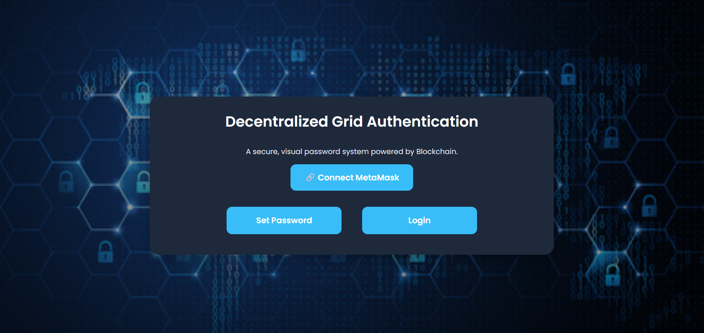</td>
    <td>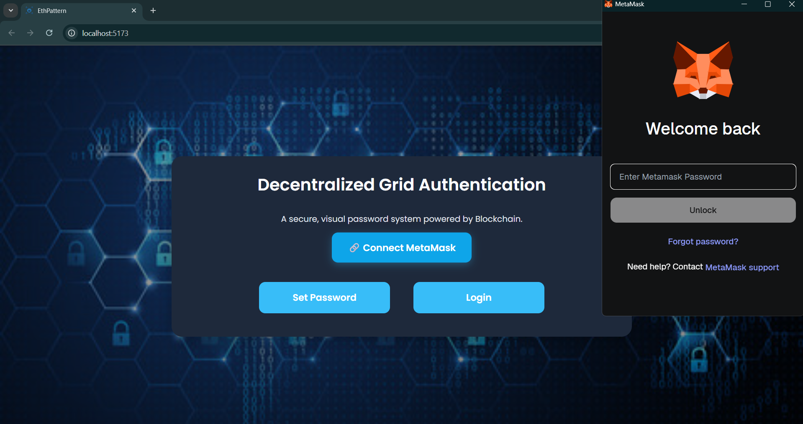</td>
    <td>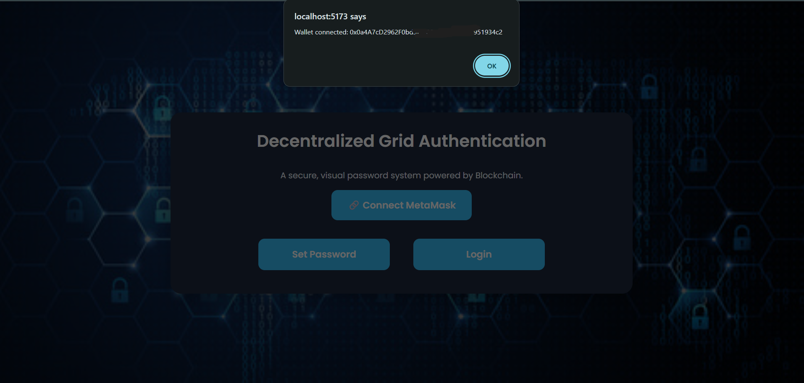</td>
  </tr>
</table>

### **2. New User Registration (Password Setup)**
*A new user selects a 4-box pattern, signs a message to create a secure key, and confirms the transaction to save their encrypted pattern on the blockchain.*

<table>
  <tr>
    <td align="center">1. Select Pattern</td>
    <td align="center">2. Create Secure Key</td>
    <td align="center">3. Approve Signature</td>
  </tr>
  <tr>
    <td>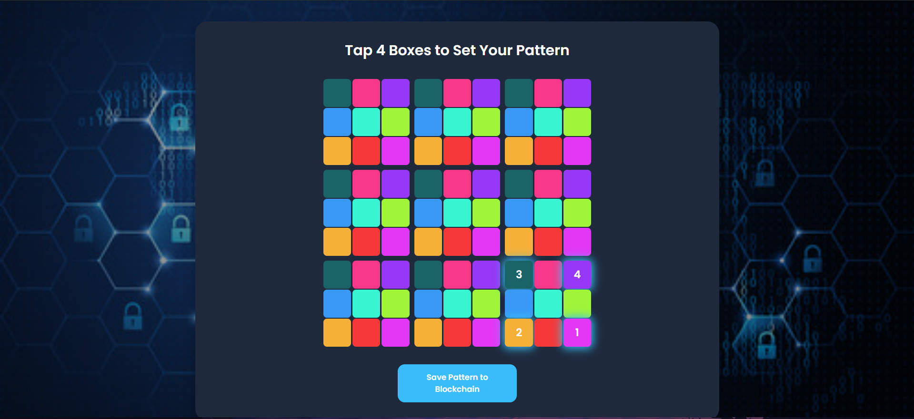</td>
    <td></td>
    <td>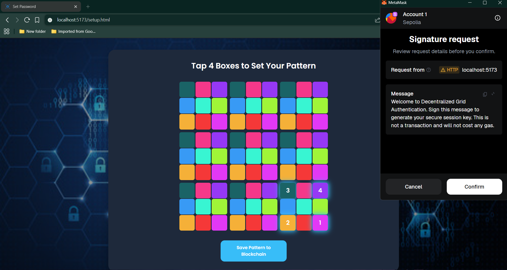</td>
  </tr>
  <tr>
    <td align="center">4. Confirm Transaction</td>
    <td align="center">5. Await Confirmation</td>
    <td align="center">6. Registration Success</td>
  </tr>
  <tr>
    <td>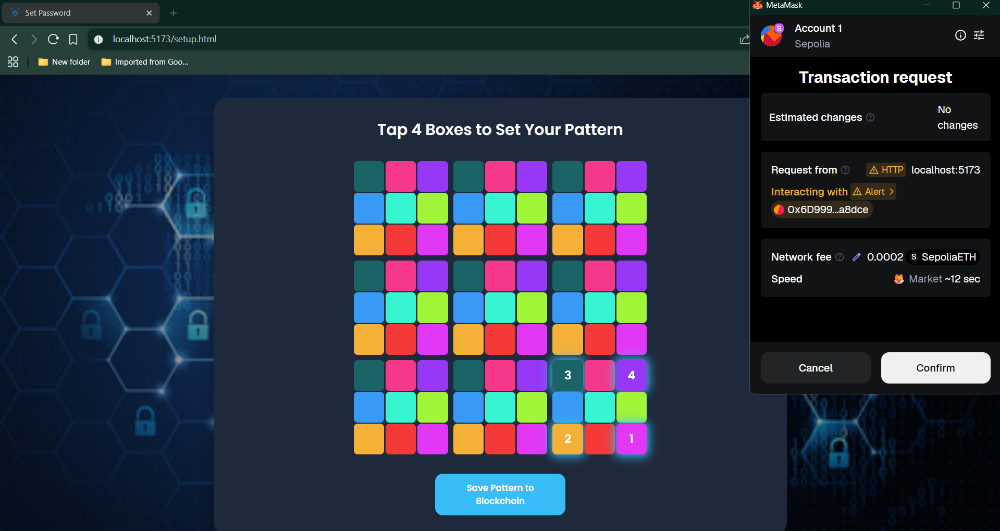</td>
    <td></td>
    <td>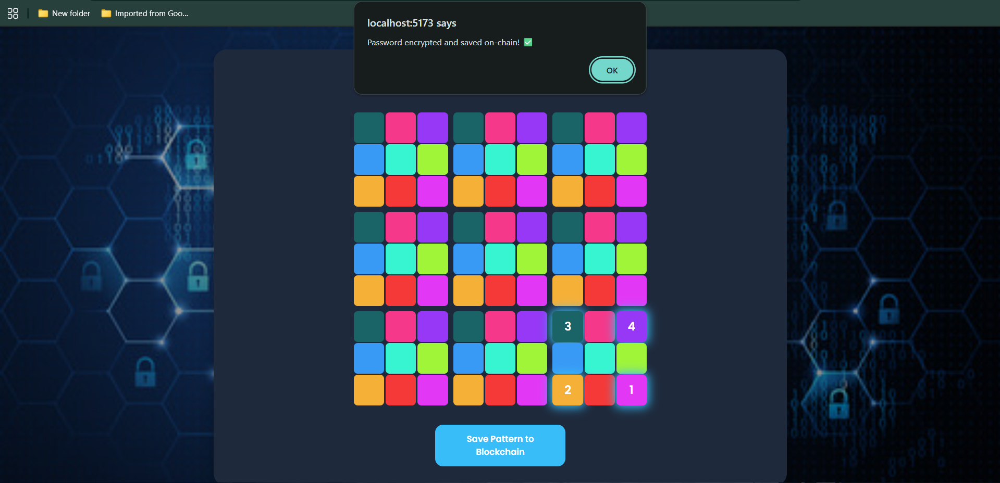</td>
  </tr>
</table>

### **3. Login & Authentication**
*An existing user is presented with a dynamic grid. They enter the PIN, sign a message to securely decrypt their pattern, and are granted access.*

<table>
<tr>
<td align="center">1. Enter Dynamic PIN</td>
<td align="center">2. Prompt to Decrypt</td>
<td align="center">3. Approve Signature</td>
</tr>
<tr>
<td>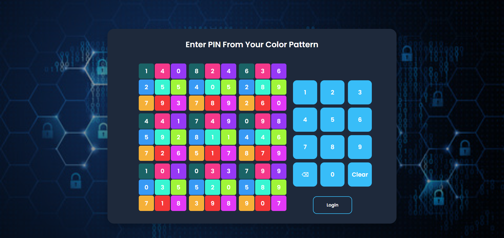</td>
<td>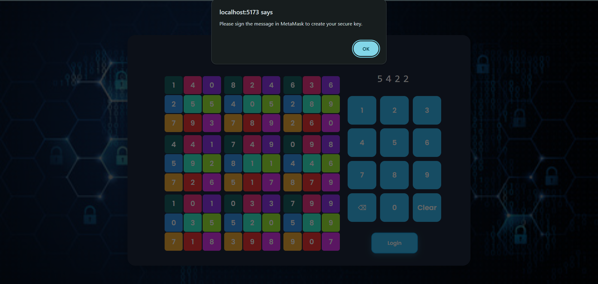</td>
<td>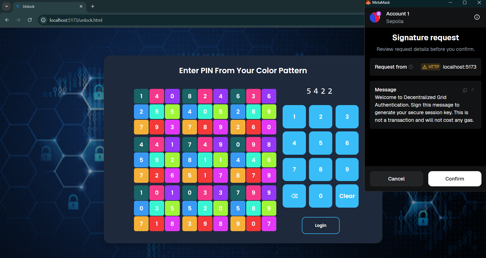</td>
</tr>
</table>

### **4. Successful Login Dashboard**
*After a successful login or update, the user is taken to their secure dashboard, which displays their connected wallet address.*

<table style="margin-left: auto; margin-right: auto; width: 50%;">
<tr>
<td align="center">Access Granted</td>
</tr>
<tr>
<td align="center">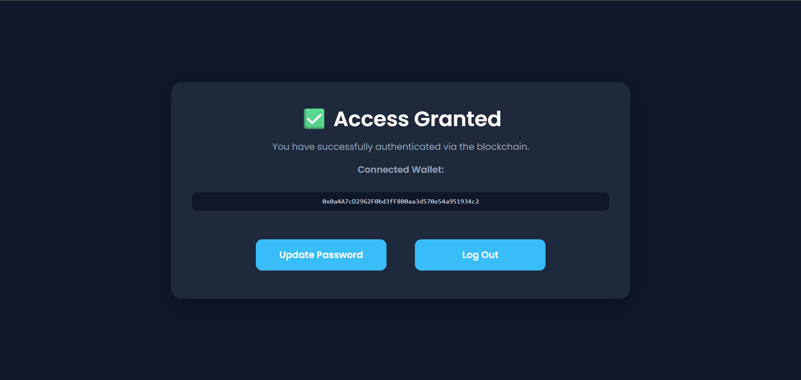</td>
</tr>
</table>

### **4. Updating an Existing Password**
*From the dashboard, a logged-in user can choose to update their pattern. They select a new pattern, sign a message, and confirm the transaction to update their encrypted data on the blockchain.*

<table>
<tr>
<td align="center">1. Select New Pattern</td>
<td align="center">2. Create Secure Key</td>
<td align="center">3. Approve Signature</td>
</tr>
<tr>
<td>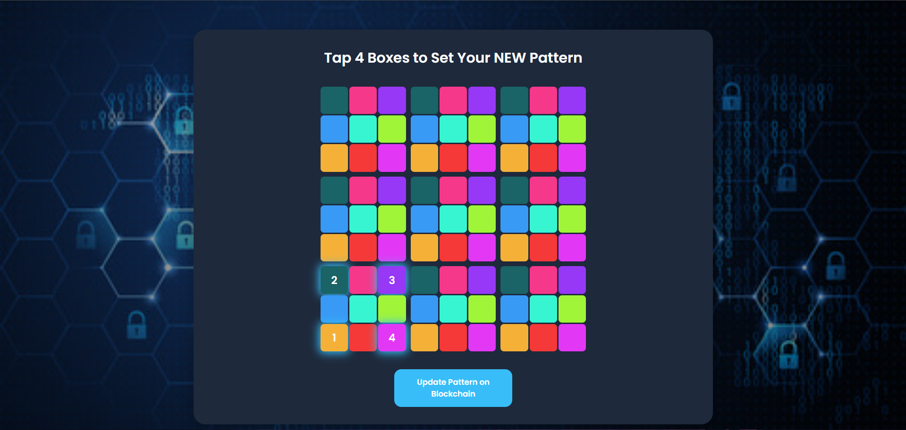</td>
<td>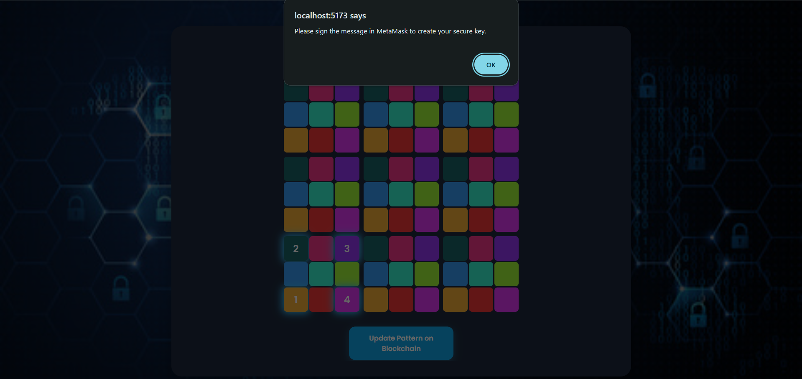</td>
<td>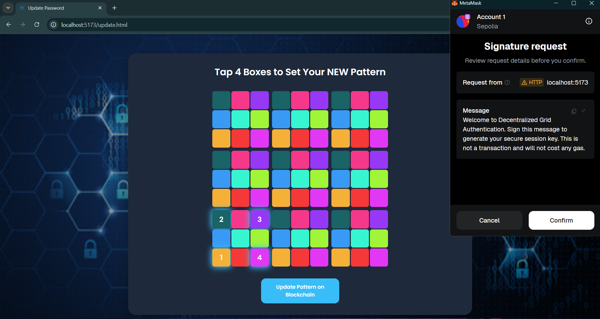</td>
</tr>
<tr>
<td align="center">4. Confirm Transaction</td>
<td align="center">5. Await Confirmation</td>
<td align="center">6. Update Success</td>
</tr>
<tr>
<td>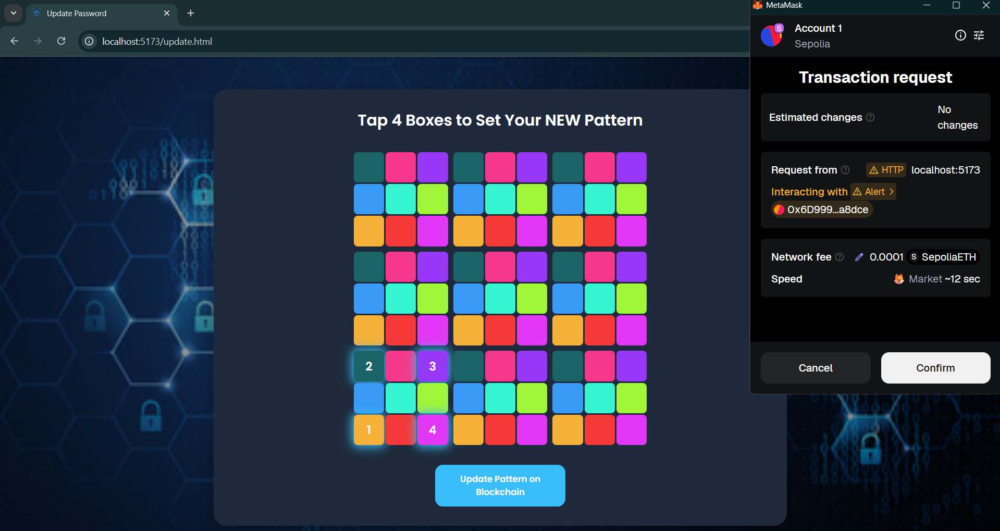</td>
<td>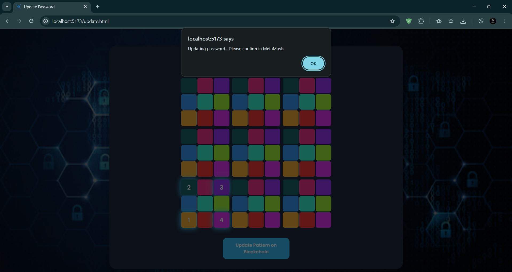</td>
<td>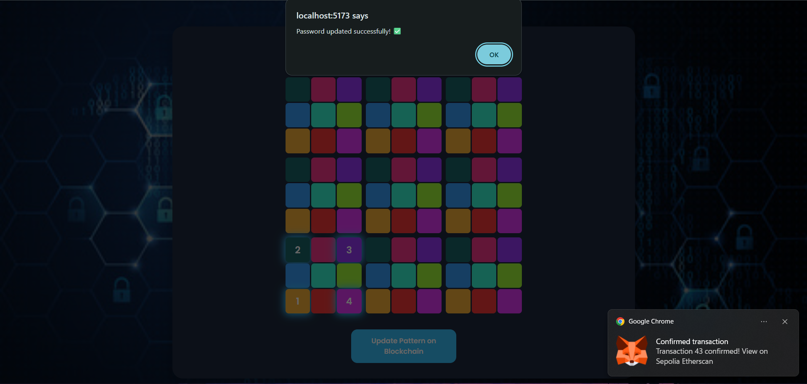</td>
</tr>
</table>

---


### 🔄 Data Flow Summary

| Step | Action                 | Location   | Description                           |
| ---- | ---------------------- | ---------- | ------------------------------------- |
| 1️⃣  | User connects MetaMask | Browser    | Requests wallet access                |
| 2️⃣  | Pattern selected       | Client     | User picks 4 grid cells               |
| 3️⃣  | Encrypt pattern        | Client     | AES encryption using wallet signature |
| 4️⃣  | Store ciphertext       | Blockchain | `register()` call → stored immutably  |
| 5️⃣  | Retrieve + decrypt     | Client     | `getMyPositions()` → AES decrypt      |
| 6️⃣  | Verify grid pattern    | Client     | Matches pattern → grants access       |

---

## ⚖️ Security & Trade-offs

| Property               | Description                                                         |
| ---------------------- | ------------------------------------------------------------------- |
| **Transparency**       | All ciphertexts are public (as in any blockchain).                  |
| **Confidentiality**    | Protected by AES client-side encryption (dependent on key entropy). |
| **Immutability**       | Once registered, data is permanent and auditable.                   |
| **No Central Control** | Users own and manage their encrypted data.                          |
| **Trade-off**          | Decentralization vs. privacy — explored as a research question.     |

---

## 🚀 Future Enhancements

#### 🔐 1. Off-Chain Authentication Layer

* Move verification off-chain using **EIP-712 signed challenges** rather than static AES keys.
* Prevent replay attacks and enable **non-deterministic session-based keys**.

#### 🧠 2. Stronger Cryptographic Design

* Replace AES-CBC with **AES-GCM** or **WebCrypto API** for confidentiality + integrity.
* Use **Argon2id or PBKDF2** for salted key derivation.

#### 🪪 3. DID (Decentralized Identity) Integration

* Integrate **DIDs / Verifiable Credentials** for privacy-preserving authentication.
* Use grid pattern as a secondary cognitive factor.

#### 💾 4. Hybrid Storage Model

* Store ciphertexts off-chain (e.g., **IPFS**) and retain only their hash on-chain.
* Improves privacy and scalability.

#### 🧩 5. Entropy-Enhanced Grid System

* Introduce **color mapping, rotation, or multiple round selections** to boost entropy.
* Study human memorability vs. randomness trade-offs.

#### ⚡ 6. Improved UI/UX & Metrics

* Add encryption performance analytics.
* Enhance visual accessibility and mobile support.

#### 🔄 7. Account Recovery & Key Rotation

* Implement optional **recovery / guardian models** and **key rotation events**.

---

### 🧭 Long-Term Research Goals

* Evaluate **usability vs. entropy** in visual authentication.
* Analyze **on-chain vs. off-chain** security models.
* Investigate **Zero-Knowledge Proofs (ZKPs)** for privacy-preserving verification.

---

### 🎓 Research Significance & Academic Contribution

This project contributes to ongoing research in **decentralized authentication systems** by demonstrating a fully **client-controlled identity mechanism** that operates without centralized servers.
Unlike traditional login systems that rely on password databases, this model integrates **blockchain immutability**, **client-side encryption**, and **human-centric authentication** to study how users can independently manage their own credentials.

From a research perspective, the **Decentralized Grid Authentication (DGA)** prototype explores:

* The **feasibility of visual grid-based secrets** as an alternative to textual passwords.
* The **interaction between transparency and privacy** in blockchain-based storage.
* The **security trade-offs** of performing all encryption, decryption, and verification client-side.

Through this prototype, the project identifies practical and theoretical limits of **storing encrypted data on public blockchains**, and provides a foundation for future work on hybrid decentralized authentication systems combining **blockchain identity, client cryptography, and usability engineering**.

---

## 👥 Contributors

| Name                 | GitHub                                               |
| -------------------- | ---------------------------------------------------- |
| **Rudra Teja Baswa** | [@Rudrateja123](https://github.com/Rudrateja123) |
| **Shaik Abu Saif**   | [@Abusaif16](https://github.com/Abusaif16)        |
| **Srujan Chowdary**  | [@srujansagg29](https://github.com/srujansagg29)   |

---

## 📚 Academic Context

This project was developed as part of an **undergraduate academic research effort** on decentralized authentication mechanisms in the Department of Computer Science & Engineering.
It is intended as a **proof-of-concept** to explore usability and security trade-offs in blockchain-based user authentication systems.

---

## 🧩 Disclaimer

This project is a **research prototype** — **not a production authentication system.**
It demonstrates blockchain integration and encryption concepts for academic and educational purposes.
No sensitive real-world credentials should be used.

---

## 📜 License

MIT License © 2025 Rudra Teja Baswa & Shaik Abu Saif

---

## 🌐 References

* Ethereum Documentation – [https://ethereum.org](https://ethereum.org)
* Solidity Docs – [https://docs.soliditylang.org](https://docs.soliditylang.org)
* MetaMask API – [https://docs.metamask.io](https://docs.metamask.io)
* CryptoJS – [https://github.com/brix/crypto-js](https://github.com/brix/crypto-js)
* Vite – [https://vitejs.dev](https://vitejs.dev)
* Ethers.js – [https://docs.ethers.io](https://docs.ethers.io)

---
